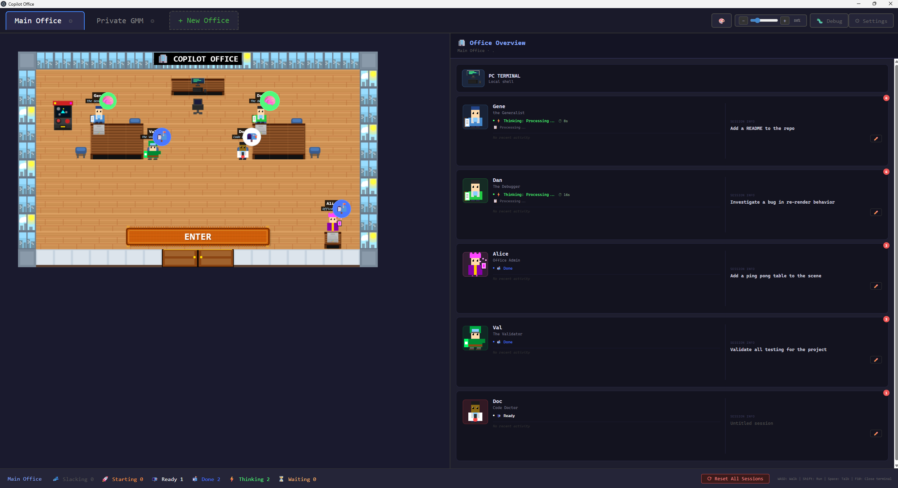

# Agency Office 🏢

A 2D pixel-art RPG-style game where you walk around a virtual office and interact with AI agents. Each NPC runs a real Copilot CLI session with full coding capabilities — plan tasks, debug code, and orchestrate multi-agent workflows from inside a game.



## Features

- **Pixel-art office environment** — all sprites procedurally generated in code, no external image assets
- **3 active NPC agents by default**, each with specialized capabilities:
  - **Gene** (Generalist) — general-purpose coding, debugging, and research
  - **Dan** (Debugger) — bug investigation and root cause analysis
  - **Alice** (Admin) — has direct access to edit this game's UI code (`workingDir: '.'`)
- **6 reserve agent slots** — Azure, Val, Rex, Doc, Scout, and Penny have pre-generated sprites ready to activate
- **Arthur (Architect)** appears in fleet v-team offices (and can be toggled into the default office in config)
- **Real terminal integration** via xterm.js — agents run actual Copilot CLI sessions through node-pty
- **Multi-office management** — switch between projects with independent agent state per office
- **Meeting Mode** — private meeting room for planning and decomposing complex tasks into structured subtasks
- **Fleet execution** — parallel agent spawning in dedicated v-team offices for approved task plans
- **Real-time status badges** — agent states (thinking, waiting, ready, slacking) with animated indicators
- **Toast & OS notifications** — configurable per-event notifications for agent activity
- **Session persistence** — terminal sessions and history survive restarts
- **Player customization** — customizable character colors
- **Mini-games** — Pong and Basketball (behind feature flags) for breaks
- **Hot reload** development mode with file watching

## Tech Stack

- **Phaser 3** — 2D game framework (sole renderer)
- **Electron 40+** — desktop app with Node.js integration
- **TypeScript** — strict mode throughout
- **esbuild** — fast bundling for game and Electron code
- **xterm.js** — terminal emulator for agent conversations
- **node-pty** — pseudo-terminal for running CLI processes

## Getting Started

### Prerequisites

- Node.js 18+
- npm

### Install from npm (global command)

```bash
npm i -g copilotoffice
copilotoffice
```

### Install from source (development)

```bash
cd AgencyOffice
npm install

# Build and run
npm start

# Development mode (with hot reload)
npm run dev
```

### Controls

| Key | Action |
|-----|--------|
| `WASD` / `Arrow Keys` | Move around the office |
| `Shift` | Sprint (2x speed) |
| `E` | Interact with nearby agent or object |
| `F10` | Close terminal |
| `Escape` | Close terminal or mini-game |
| `Ctrl+Shift+N` | New terminal session |

## Project Structure

```
AgencyOffice/
├── electron/                    # Electron main process
│   ├── main.ts                  # Window, IPC handlers, hot reload
│   ├── cli-bridge.ts            # Mock/placeholder (not used at runtime)
│   └── terminal/                # Terminal server subsystem
│       ├── server.ts            # PTY owner (forked child process)
│       ├── ipc-relay.ts         # IPC bridge (renderer ↔ main ↔ server)
│       ├── preload.ts           # Context bridge (window.copilotBridge)
│       ├── protocol.ts          # IPC message type definitions
│       └── events-watcher.ts    # Copilot CLI event file parser
├── src/                         # Renderer process (Phaser + DOM)
│   ├── main.ts                  # Entry point — DOM layout, Phaser init, IPC wiring
│   ├── index.html               # HTML host page
│   ├── scenes/                  # Phaser scenes
│   │   ├── BootScene.ts         # Procedural sprite generation
│   │   ├── OfficeScene.ts       # Main game scene (layout, NPCs, interactions)
│   │   └── MeetingScene.ts      # Meeting room with Arthur for planning
│   ├── entities/                # Game entities
│   │   ├── Player.ts            # Player character with movement
│   │   └── NPC.ts               # NPC agents with status badges
│   ├── sprites/                 # Procedural sprite generation
│   │   ├── SpriteGenerator.ts   # Sprite sheet generation
│   │   └── DirectionalSprite.ts # 4-direction animation utilities
│   ├── ui/                      # UI overlays
│   │   ├── TerminalOverlay.ts   # xterm.js terminal for agent sessions
│   │   ├── FleetDashboard.ts    # Fleet execution dashboard
│   │   ├── PongGame.ts          # Pong mini-game
│   │   ├── BasketballGame.ts    # Basketball mini-game
│   │   ├── ToastNotification.ts # Toast notification popups
│   │   ├── NotificationService.ts
│   │   ├── NotificationSettingsPanel.ts
│   │   ├── CameraDragController.ts
│   │   └── DialogBox.ts         # Legacy (deprecated)
│   ├── input/                   # Keyboard focus management
│   │   ├── InputManager.ts      # Central coordinator
│   │   ├── GameInputListener.ts
│   │   ├── GlobalInputListener.ts
│   │   └── TerminalInputListener.ts
│   ├── office/                  # Multi-office state management
│   │   └── officeManager.ts     # Office CRUD, agent status tracking
│   ├── meeting/                 # Meeting mode & fleet orchestration
│   │   ├── types.ts             # MeetingPlan, TaskAssignment, FleetStatus
│   │   ├── planParser.ts        # Terminal output → structured plan
│   │   ├── planApproval.ts      # Plan review overlay
│   │   ├── fleetOrchestrator.ts # Parallel agent spawning
│   │   ├── fleetTracker.ts      # Fleet state machine
│   │   └── fleetVisualizer.ts   # Fleet NPC visualization
│   ├── layouts/                 # Layout system
│   │   ├── types.ts             # DashboardRenderer, LayoutDefinition
│   │   ├── index.ts             # Layout registry
│   │   ├── default/             # Default office layout
│   │   └── fleet/               # Fleet v-team layout
│   └── config/                  # Static configuration
│       ├── agents.ts            # Agent definitions & fleet config
│       ├── depths.ts            # Phaser depth layer constants
│       ├── notifications.ts     # Notification event settings
│       ├── meetingPrompt.ts     # Meeting coordinator prompt
│       └── playerCustomization.ts # Player color customization
└── dist/                        # Build output
```

## Adding New Agents

Edit `src/config/agents.ts` to add new NPCs. Six reserve agent slots (Azure, Val, Rex, Doc, Scout, Penny) already have pre-generated sprites — activate one by adding its config to the `AGENTS` array:

```typescript
{
  id: 'unique-id',
  name: 'Display Name',
  skill: 'copilot-skill-name',
  sprite: 'sprite_key',
  color: 0xff0000,  // Hex color for procedural sprite
  position: { x: 5, y: 7 },  // Grid position in office
  greeting: "Hello message when player approaches",
  description: 'Short description',
  workingDir: 'optional/path',  // Optional custom working directory
}
```

Sprites are auto-generated based on the color — no image assets needed.

## Development

```bash
# Watch mode with hot reload
npm run dev

# Build only (no run)
npm run build

# Run without rebuilding
npm run electron
```

## Release channels

- **Stable**: `npm i -g copilotoffice` (uses npm `latest` dist-tag)
- **Beta**: `npm i -g copilotoffice@beta` (uses npm `beta` dist-tag)

For maintainers: pushing to GitHub is not enough for `npm i -g copilotoffice` by name.
You must publish to npm. Typical flow:

```bash
npm run build
npm test
npm version patch
npm publish

# Beta example
npm version prerelease --preid=beta
npm publish --tag beta
```

## License

ISC
