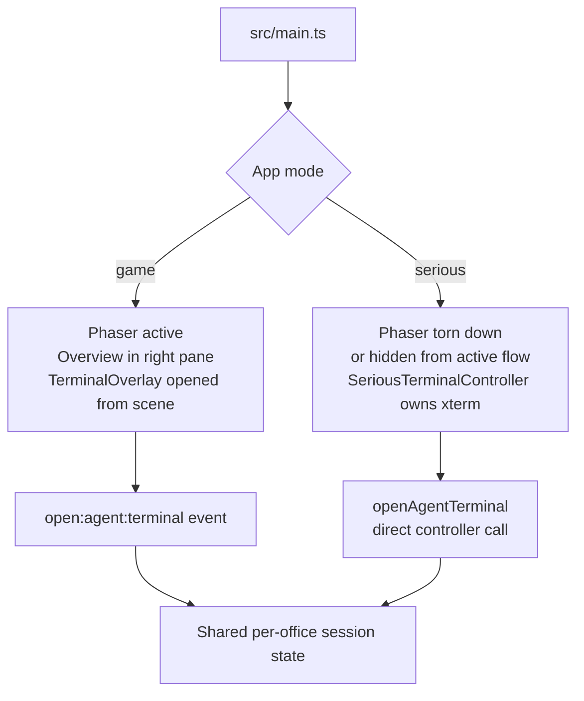
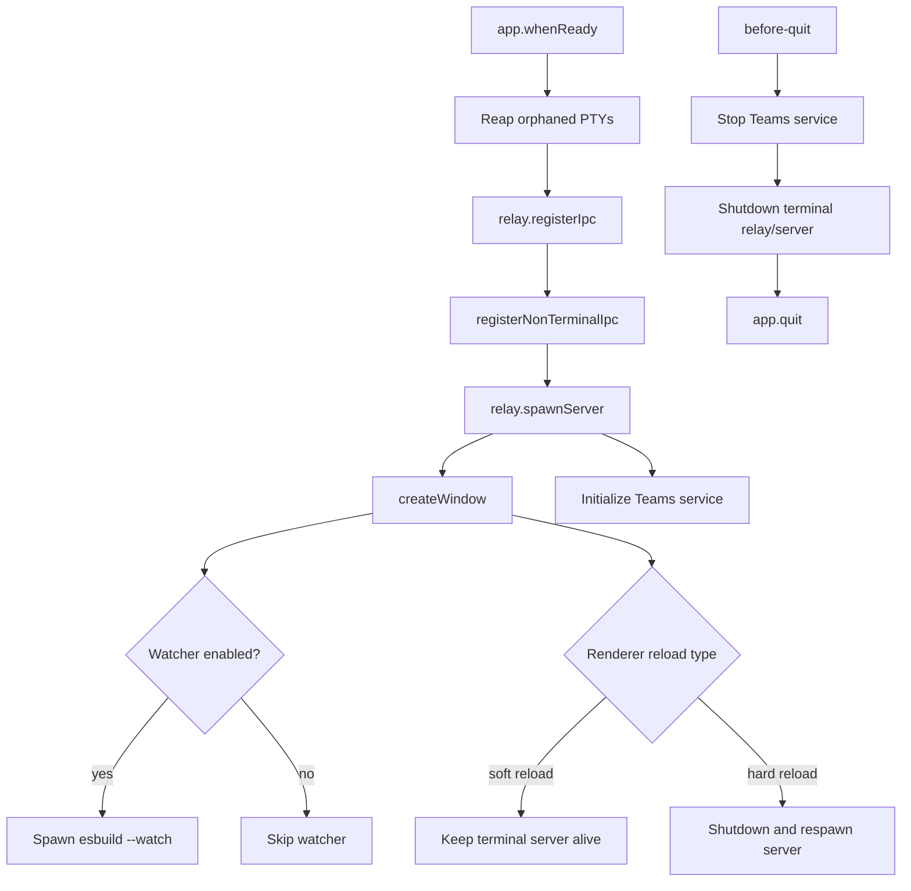
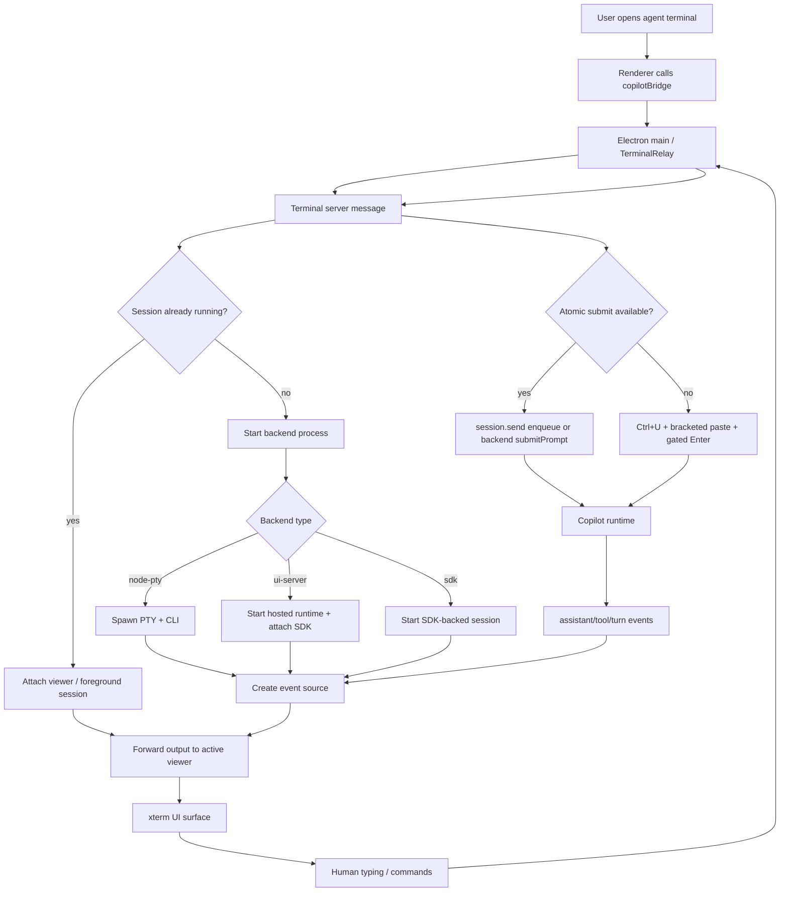
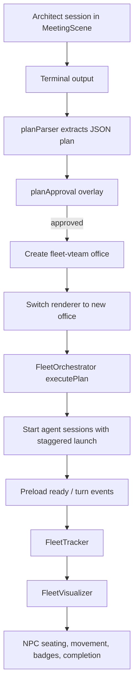
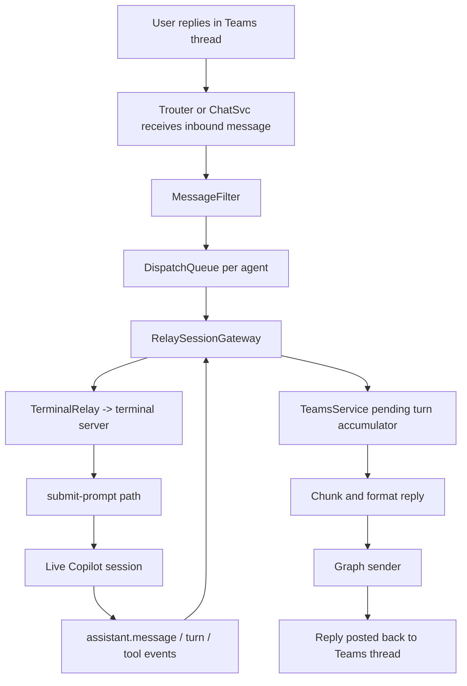

# Copilot Office Architecture

Last updated: 2026-07-09

This document reflects the current repository, not the older single-overlay PTY design. Copilot Office is now a split-layout Electron app with two renderer modes, per-office session persistence, a dedicated terminal server child process, optional SDK-backed terminal control, meeting-driven fleet execution, and Teams-based remote-agent operation.

## 1. Executive Summary

Copilot Office is a desktop app that combines:

- Phaser 3 for the office and meeting-room game world
- DOM + xterm.js for terminal and dashboard surfaces
- Electron main-process services for windows, IPC, persistence, notifications, and Teams connectivity
- A forked terminal server process that owns PTYs, session state, event forwarding, and terminal backend selection
- Real Copilot CLI sessions as the core user-facing agent runtime

The architecture is governed by the repository constitution in `.specify/memory/constitution.md`. The most important architectural rules are:

1. Phaser remains the only in-canvas renderer.
2. Cross-layer coordination flows through explicit events or IPC.
3. Agent interactions must preserve real session continuity end to end.
4. Terminal clipboard behavior must stay mirrored across both terminal UIs.
5. Verification must be worktree-aware because each checkout has its own `dist/` output.

## 2. System Map

```mermaid
flowchart LR
  User[User] --> Renderer

  subgraph Renderer[Renderer Process]
    Main[src/main.ts]
    Phaser[Phaser scenes\nBootScene -> OfficeScene -> MeetingScene]
    DOM[DOM shell\nTabs + Overview + Status bar]
    Overlay[TerminalOverlay\nGame mode]
    Serious[SeriousTerminalController\nSerious mode]
    OfficeState[officeManager\nPure office state]
    Meeting[Meeting + Fleet modules]
  end

  subgraph ElectronMain[Electron Main Process]
    MainProc[electron/main.ts]
    Relay[TerminalRelay]
    Teams[TeamsService]
    FileStore[Office + settings stores]
  end

  subgraph TermServer[Terminal Server Child]
    Server[electron/terminal/server.ts]
    Backends[Terminal backends\nnode-pty | ui-server | sdk]
    Events[Event sources\nSDK session.on or file watcher]
    Sessions[Per-office session state\nscrollback + viewer maps]
  end

  subgraph External[External Systems]
    CLI[Copilot CLI runtime]
    SDK[@github/copilot-sdk]
    Graph[Microsoft Graph]
    Trouter[Trouter / ChatSvc receive]
    Disk[.data + localStorage]
  end

  Main --> Phaser
  Main --> DOM
  Main --> Overlay
  Main --> Serious
  Main --> OfficeState
  Main --> Meeting

  Renderer -->|IPC via preload| MainProc
  MainProc -->|events and replies| Renderer
  MainProc --> Relay
  MainProc --> Teams
  MainProc --> FileStore
  Relay <--> Server
  Server --> Backends
  Server --> Events
  Server --> Sessions
  Backends <--> CLI
  Backends <--> SDK
  Teams <--> Graph
  Teams <--> Trouter
  OfficeState <--> Disk
  Server <--> Disk
  Teams <--> Disk
```

## 3. Architectural Principles

### Phaser-first rendering

Phaser scenes own the game world, NPC sprites, movement, interaction prompts, meeting room, and mini-games. DOM is used only for shell UI and overlays such as dashboards, settings, and xterm-based terminals.

### Event-driven boundaries

The renderer coordinates through `game.events`, `officeManager` callbacks, and preload IPC. Main-process services communicate through explicit message channels rather than hidden cross-module references.

### Real-agent session integrity

The terminal path is intentionally layered:

`renderer -> preload bridge -> electron main -> terminal relay -> terminal server -> backend -> Copilot runtime`

That chain is treated as a product invariant. Office switching, fleet transitions, Teams dispatch, and app-mode changes are all implemented around preserving session identity and reattaching viewers rather than destroying sessions unnecessarily.

### Configuration-first extensibility

Agent rosters, layout capabilities, notification behavior, Teams defaults, responsive layout, YOLO mode, extra CLI parameters, and auto-start are all configuration-driven. New scene behavior is expected to ask the layout or config layer rather than hardcode IDs or layout strings.

## 4. Renderer Architecture

### 4.1 `src/main.ts`

`src/main.ts` is the browser entrypoint and shell composer. It does more than start Phaser.

Its main responsibilities are:

1. Ensure the default office exists and synchronize the active roster.
2. Build the DOM shell: office tabs, split panes, overview host, terminal host, and status bar.
3. Maintain app mode: `game` or `serious`.
4. Maintain responsive layout state, including portrait-dashboard behavior.
5. Bridge renderer-side agent state to dashboards and serious-mode terminal views.
6. Route office switching, status refreshes, and session metadata refreshes.
7. Create and manage `SeriousTerminalController`.
8. Forward focus-open and focus-close events for modal overlays back into Phaser input management.

### 4.2 App modes

The app has two distinct presentation modes.



`game` mode keeps Phaser active and uses `TerminalOverlay` as a DOM surface tied to the scene. `serious` mode routes terminal interactions through `SeriousTerminalController`, keeps the overview visible, and uses the right pane as a persistent terminal workspace.

### 4.3 Scenes

#### `BootScene`

Responsibilities:

- Generate sprite textures procedurally
- Prepare player, NPC, furniture, and mini-game visual assets
- Transition into `OfficeScene`

#### `OfficeScene`

Responsibilities:

- Build the active office layout
- Instantiate player, NPCs, furniture, and interaction prompts
- Manage movement, depth sorting, proximity checks, and `E`-key interaction
- Launch `TerminalOverlay` in game mode
- Bridge to `MeetingScene`
- Host fleet tracking and visualization when the current office is `fleet-vteam`
- Rebuild on `office:switch` and `layout:change`

Feature flags still live here for optional content such as decorations and mini-games.

#### `MeetingScene`

Responsibilities:

- Run the architect-driven planning experience
- Collect plan output from the agent terminal
- Parse and validate structured JSON plans
- Launch the approval flow
- Return an approved `MeetingPlan` back to `OfficeScene`

### 4.4 Office state and layout system

The renderer deliberately separates data from rendering.

- `src/office/officeManager.ts` is the pure office-state layer.
- `src/layouts/index.ts` resolves a `LayoutDefinition` for each office layout.
- `src/layouts/types.ts` defines layout behaviors so scene code can ask capabilities instead of string-comparing layout IDs.

Current layouts:

| Layout | Purpose | Key behaviors |
| --- | --- | --- |
| `default` | Main office with core agents, reserve seating, and player PC terminal | Reserve agents supported, player PC supported |
| `fleet-vteam` | Fleet execution office for meeting-generated plans | Architect-only interaction, no reserve seating, fleet execution enabled |

### 4.5 Terminal UI surfaces

There are two xterm-based terminal surfaces and they must stay behaviorally aligned.

| Surface | File | Context |
| --- | --- | --- |
| `TerminalOverlay` | `src/ui/TerminalOverlay.ts` | Game mode, opened from Phaser scene interaction |
| `SeriousTerminalController` | `src/ui/SeriousTerminalController.ts` | Serious mode, persistent pane-based terminal |

Shared expectations:

- Both use `@xterm/xterm` plus `@xterm/addon-fit`.
- Both support session metadata, session history, new-session flows, detach behavior, and Teams remote controls.
- Both must honor the constitution's clipboard-selection rules.
- Both need mirrored fixes for selection, copy, wheel paging, and terminal context-menu behavior.

### 4.6 Input model

The renderer uses a three-tier input model.

- `InputManager` is the only allowed focus coordinator.
- Phaser gameplay input is suspended and resumed through events such as `settings:open` and `settings:close`.
- Terminal focus never directly manipulates Phaser keyboard internals as a shortcut.

This is an explicit anti-regression boundary because terminal focus bugs and Phaser key capture bugs have been recurring failure modes.

## 5. Electron Main Process

### 5.1 `electron/main.ts`

The Electron main process is now a coordinator, not a PTY owner.

Responsibilities:

1. Create the BrowserWindow and load `src/index.html`.
2. Register terminal IPC through `TerminalRelay`.
3. Spawn and supervise the terminal server child process.
4. Register non-terminal IPC such as hard reload, office persistence, clipboard, and notifications.
5. Reap orphaned PTY trees from earlier crashes via `.data/pty-pids.json`.
6. Optionally run an esbuild watch process in development.
7. Initialize the Teams remote-agents service.
8. Distinguish soft reload from hard reload so the terminal server can either survive or respawn.

### 5.2 Main-process composition



### 5.3 Preload boundary

`electron/terminal/preload.ts` exposes the renderer API on `window.copilotBridge`.

That bridge covers:

- terminal lifecycle methods
- terminal data and exit events
- session metadata operations
- status and Copilot event subscriptions
- Teams IPC methods
- clipboard bridging
- office persistence operations

The preload layer is the only renderer-visible boundary into Electron.

## 6. Terminal Architecture

### 6.1 Why the terminal server exists

Terminal ownership moved out of Electron main into `electron/terminal/server.ts`. That child process owns all terminal runtime state so that Electron main can stay focused on windowing, IPC registration, and higher-level services.

The server owns:

- live PTY or SDK-backed terminal processes
- per-office session files and metadata
- scrollback buffers
- ready-state and turn-state tracking
- viewer attachment maps
- Copilot event-source wiring
- fallback behavior between backends
- programmatic submit behavior for non-human drivers such as Teams

### 6.2 Composite session identity

The current terminal design is office-aware. Terminal keys are composite:

`officeId:agentId`

That affects:

- viewer attachment
- session metadata lookup
- scrollback buffers
- session persistence
- readiness checks
- forwarding to Teams or fleet consumers

This is a major change from the older global `agentId -> session` model and is one reason the old architecture document is stale.

### 6.3 Backend abstraction

`electron/terminal/terminal-backend.ts` defines the runtime abstraction.

| Backend | Role | Current status |
| --- | --- | --- |
| `node-pty` | Traditional PTY-hosted Copilot CLI session per agent | Default and permanent fallback |
| `ui-server` | Hybrid mode: node-pty hosts real TUI, SDK attaches over local control connection | Target architecture from spec 013 |
| `sdk` | Legacy headless SDK-backed terminal path | Retained for compatibility, not preferred |

Important backend rules:

1. `ui-server` support must be probed because the CLI flag is undocumented.
2. Start-time fallback to `node-pty` is required if `ui-server` launch fails.
3. Human typing still goes through the terminal surface; programmatic prompt submission prefers the backend's atomic submit path.

### 6.4 Event sources

The server can source Copilot events in two ways.

| Source | Used by | Mechanism |
| --- | --- | --- |
| File watcher | Raw PTY backends | Tail `events.jsonl` under `~/.copilot/session-state/...` |
| SDK event source | SDK-attached backends | Subscribe to `session.on(...)` |

The server normalizes both into the same event stream for the rest of the app.

### 6.5 Open, attach, send, and receive flow



### 6.6 Viewer alias invariant

Transferred or reattached sessions rely on dual-key viewer bookkeeping in `electron/terminal/agent-viewers.ts`.

The invariant is:

- viewer mutations must go through `addAgentViewer`, `removeAgentViewer`, and `hasActiveViewer`
- direct `Set.add` or `Set.delete` is reserved for narrowly-defined cleanup paths

This protects fleet session transfer and office-switch continuity.

### 6.7 Programmatic prompt submission

The server supports non-human prompt injection through a separate path from raw terminal typing.

- SDK-capable backends use atomic `submitPrompt` behavior.
- Raw PTY fallback uses guarded keystroke injection: clear line, bracketed paste, then retry Enter until a matching `user.message` confirms acceptance.

This exists because bare `write(prompt + '\r')` is not reliable against the interactive Copilot TUI.

## 7. Meeting and Fleet Architecture

Meeting mode turns the architect into a task planner and fleet launcher.

### 7.1 Core modules

| Module | Role |
| --- | --- |
| `src/meeting/planParser.ts` | Extract and validate JSON plans from terminal output |
| `src/meeting/planApproval.ts` | Approval UI for generated plans |
| `src/meeting/fleetOrchestrator.ts` | Spawn phase for multiple agent terminals |
| `src/meeting/fleetTracker.ts` | Track sub-agent and task progress |
| `src/meeting/fleetVisualizer.ts` | Reflect fleet progress into office NPC movement and status |
| `src/meeting/types.ts` | Shared contracts such as `MeetingPlan` and task assignment types |

### 7.2 Fleet flow



### 7.3 Fleet office behavior

The fleet office is not just a visual variant.

It changes behavior in meaningful ways:

- interaction is restricted to the architect role
- the layout disables reserve-agent seating behavior
- fleet lifecycle events remain relevant even when a terminal viewer is not open
- the renderer treats the meeting result as a new office context, not as a transient popup

## 8. Teams Remote Agents

The Teams feature in `electron/teams/*` makes an agent session remotely drivable from a Teams thread while still preserving the local session.

### 8.1 Main components

| Module | Role |
| --- | --- |
| `teamsService.ts` | Orchestrator for lifecycle, routing, replies, reconnect, and teardown |
| `auth.ts` | Token acquisition |
| `graphClient.ts` | Graph send path |
| `trouterClient.ts` | Real-time receive transport |
| `chatsvcClient.ts` | Polling or fallback receive path |
| `messageFilter.ts` | Dedupe, marker checks, staleness checks, and message classification |
| `dispatchQueue.ts` | Per-agent serialized dispatch queue |
| `sessionGateway.ts` | Adapter over `TerminalRelay` into the existing terminal system |
| `onlineAgentsStore.ts` | Disk-backed online binding persistence and GC |
| `teamsSettingsStore.ts` | Global Teams settings persistence |

### 8.2 Remote-agent flow



### 8.3 Important constraints

1. The Teams feature is gated by persisted settings.
2. Outbound channel posting is allowlisted.
3. Tokens can be cached with OS-backed encryption.
4. Event forwarding must remain enabled for online agents even without an active renderer viewer.
5. The current gateway assumes a single online binding per `agentId` across offices.

## 9. Persistence Model

Persistence is intentionally split by concern.

| Location | Purpose |
| --- | --- |
| `.data/copilot-offices.json` | Durable office configs |
| `.data/<officeId>.sessions.json` | Current and historical per-office session IDs plus metadata |
| `.data/pty-pids.json` | PTY roots used for orphan cleanup |
| `.data/teams-settings.json` | Global Teams settings |
| `.data/teams-online-agents.json` | Online Teams bindings and known threads |
| `.data/teams-token.enc` | Encrypted Teams token cache when available |
| `localStorage` | UI state such as app mode, zoom, office sort, session meta cache, and sprite cache |

The session file format is office-scoped and supports:

- current session IDs by agent
- session history by agent
- session metadata such as titles

The terminal server also repairs duplicate session IDs when loading persisted state.

## 10. Build, Packaging, and Test Surfaces

### 10.1 Build outputs

The repo builds two runtime surfaces.

| Output | Built from | Purpose |
| --- | --- | --- |
| `dist/game.bundle.js` | `src/main.ts` | Renderer bundle |
| `dist/electron/*` | `electron/main.ts`, `electron/terminal/*`, and related entrypoints | Electron main, preload, and terminal runtime bundle set |

The repo uses esbuild directly from `package.json` scripts.

### 10.2 Primary scripts

| Script | Purpose |
| --- | --- |
| `npm run build` | Build renderer and Electron outputs |
| `npm start` | Build and run the app |
| `npm run dev` | Watch mode for renderer and Electron bundles plus app launch |
| `npm run test` | Vitest suite |
| `npm run test:coverage` | Vitest with coverage |
| `npm run test:e2e` | Build plus Playwright end-to-end suite |

### 10.3 Worktree warning

This repository frequently uses multiple worktrees. Each worktree has its own `dist/` directory. If behavior appears unchanged after a fix, the first question is whether the user launched the rebuilt bundle from the correct checkout.

That is a constitution-level verification rule, not a convenience note.

## 11. Current Module Map

### Renderer

```text
src/
├── main.ts                    # DOM shell, app mode, office switching, status wiring
├── scenes/                    # BootScene, OfficeScene, MeetingScene
├── office/                    # Office state and persistence port
├── layouts/                   # default and fleet-vteam layout registry and behavior
├── meeting/                   # plan parser, approval, orchestration, tracking, visualization
├── ui/                        # overlay terminals, serious terminal, settings, mini-games, toasts
├── config/                    # agents, meeting prompt, auto-start, backend, responsive layout, etc.
├── input/                     # InputManager and listeners
├── entities/                  # Player and NPC classes
├── sprites/                   # procedural sprite generation and helpers
└── util/                      # state transition helpers and guards
```

### Electron

```text
electron/
├── main.ts                    # Window lifecycle and service composition
├── nonTerminalIpc.ts          # Clipboard, notifications, reload, persistence IPC
├── officeFileStore.ts         # Durable office storage abstraction
├── terminal/
│   ├── preload.ts             # contextBridge API
│   ├── ipc-relay.ts           # main <-> server relay
│   ├── server.ts              # terminal runtime owner
│   ├── terminal-backend.ts    # node-pty, ui-server, sdk backends
│   ├── event-source.ts        # SDK and file-watcher event sources
│   ├── events-watcher.ts      # file-backed Copilot event parsing
│   ├── agent-viewers.ts       # transferred-session viewer invariant
│   ├── session-repair.ts      # persisted session cleanup helpers
│   └── protocol.ts            # relay protocol contracts
└── teams/                     # remote-agent transport, filtering, routing, persistence
```

## 12. Regression Hotspots

These are the areas future changes are most likely to break.

### 12.1 Terminal parity

Any change to copy, selection, terminal wheel behavior, session title editing, or Teams remote controls must be mirrored across:

- `src/ui/TerminalOverlay.ts`
- `src/ui/SeriousTerminalController.ts`

### 12.2 Office switching

Office changes are not cosmetic. They affect:

- active roster swaps
- per-office session keys
- Teams channel overrides
- viewer attachment
- session metadata cache
- auto-start warming

### 12.3 Fleet and no-viewer event forwarding

Some events are operationally important even when nobody is watching the terminal. Regressing that behavior breaks fleet status and Teams reply capture.

### 12.4 Layout capability checks

New scene logic should read `getLayout(...).behaviors` instead of string-comparing layout IDs.

### 12.5 Hardcoded agent IDs

Use the named constants from `src/config/agents.ts` for architect, generalist, debugger, admin, and valid plan-agent IDs.

## 13. What Has Changed Since the Older Architecture Doc

The previous document mostly described a simpler model:

- Electron main directly owning PTYs
- a single dominant terminal overlay concept
- flat session persistence
- no serious-mode terminal workspace
- no per-office session files
- no dedicated terminal server child process
- no SDK-backed control-plane architecture
- no Teams remote-agent orchestration layer

That is no longer the system. The current architecture is explicitly multi-surface, office-scoped, and service-oriented around a terminal server core.
