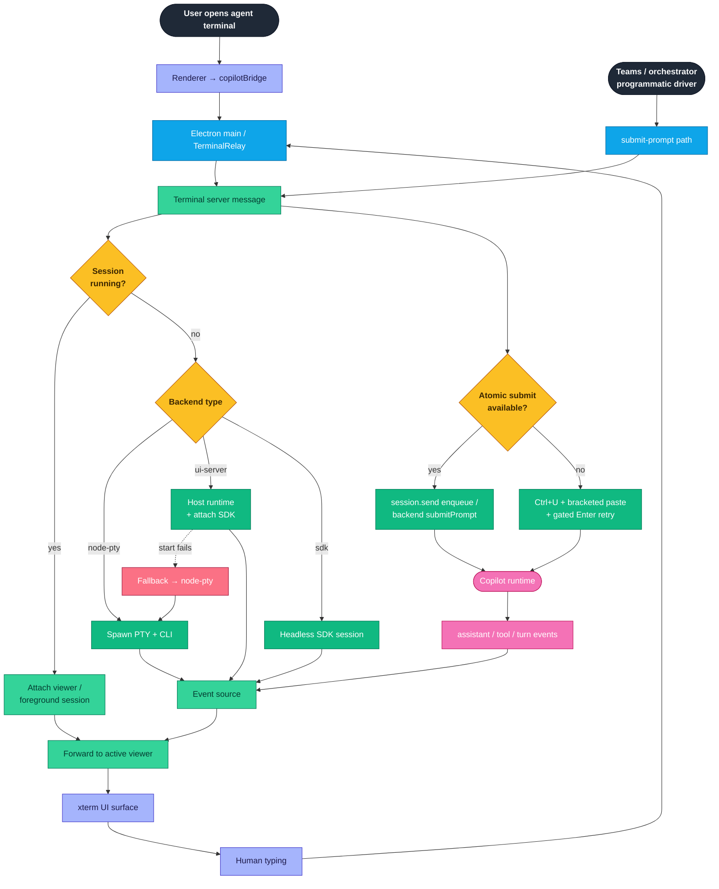
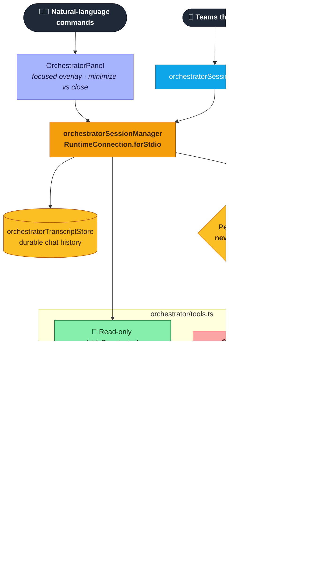
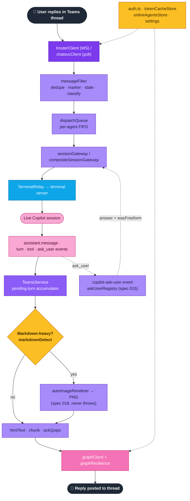
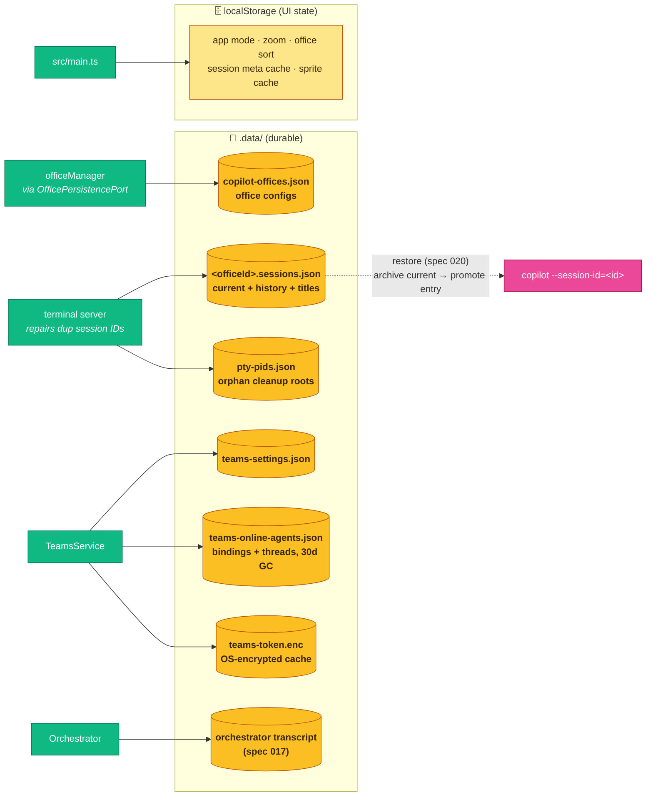
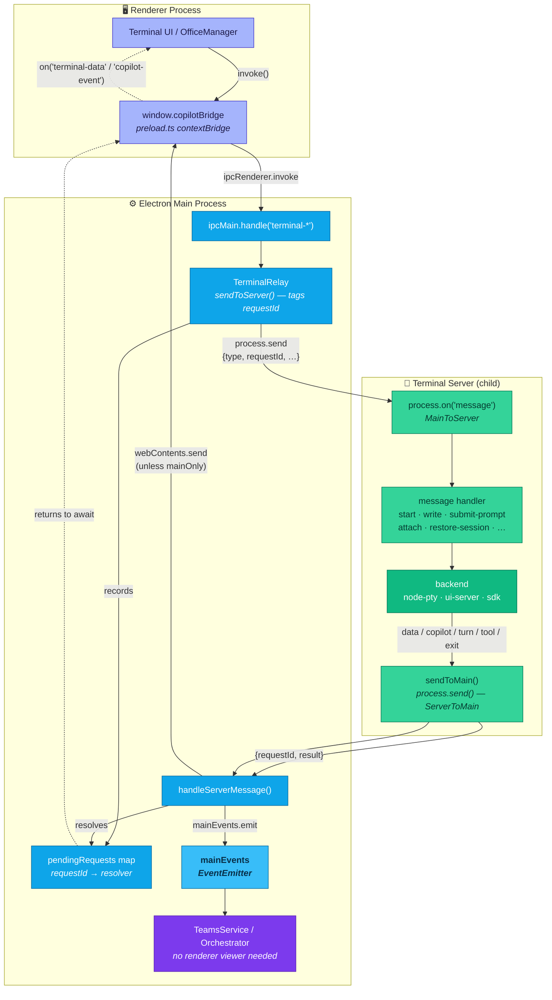
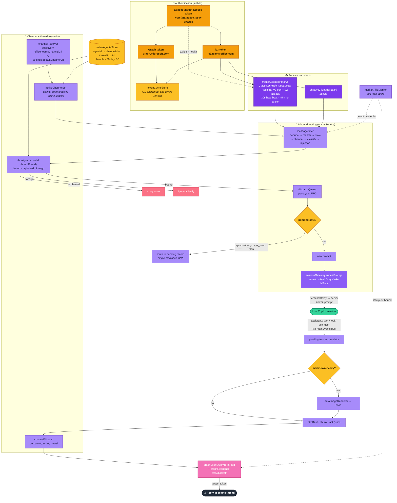

# Copilot Office — Architecture Diagram

A visual companion to [`architecture.md`](./architecture.md). Preview in VS Code with a
Mermaid-capable Markdown preview extension (e.g. *Markdown Preview Mermaid Support*).

---

## 1. System Overview

The whole stack at a glance: renderer surfaces, the Electron main coordinator, the
forked terminal server that owns all PTY/SDK runtime state, and the external systems
they talk to.

```mermaid
flowchart TB
  User(["🧑‍💻 User"]):::actor

  subgraph Renderer["🖥️ Renderer Process — Phaser + DOM"]
    direction TB
    Main["main.ts<br/><i>shell · app mode · office switching</i>"]:::rcore
    Phaser["Phaser Scenes<br/>Boot → Office → Meeting"]:::rphaser
    DOM["DOM Shell<br/>tabs · overview · status bar"]:::rdom
    TermUI["Terminal Surfaces<br/>TerminalOverlay · SeriousTerminalController"]:::rdom
    OrchUI["OrchestratorPanel<br/><i>focused overlay</i>"]:::rdom
    OfficeState["officeManager<br/><i>pure office state</i>"]:::rstate
    Layouts["Layout Registry<br/>default · fleet-vteam"]:::rstate
    Meeting["Meeting + Fleet<br/>parser · approval · orchestrator · tracker · visualizer"]:::rstate
    Input["InputManager<br/><i>focus coordinator</i>"]:::rstate
  end

  subgraph MainProc["⚙️ Electron Main Process"]
    direction TB
    EMain["main.ts<br/><i>windows · service composition</i>"]:::mcore
    Relay["TerminalRelay<br/><i>main ⇄ server</i>"]:::mcore
    Orchestrator["Orchestrator Agent<br/><i>always-gated SDK session</i>"]:::morch
    Teams["TeamsService<br/><i>remote-agent transport</i>"]:::mteams
    Stores["File Stores<br/>offices · settings · tokens"]:::mstore
  end

  subgraph TermServer["🧵 Terminal Server (child process)"]
    direction TB
    Server["server.ts<br/><i>runtime owner · composite sessions</i>"]:::score
    Backends["Backends<br/>node-pty · ui-server · sdk"]:::sback
    Events["Event Sources<br/>file watcher · session.on"]:::sevent
    Sessions["Session State<br/>scrollback · viewer maps · history"]:::sstate
  end

  subgraph External["🌐 External Systems"]
    direction TB
    CLI["Copilot CLI Runtime"]:::ext
    SDK["@github/copilot-sdk"]:::ext
    Graph["Microsoft Graph"]:::ext
    Trouter["Trouter / ChatSvc"]:::ext
    Disk[("💾 .data + localStorage")]:::disk
  end

  User --> Renderer
  Main --> Phaser & DOM & TermUI & OrchUI & OfficeState & Layouts & Meeting & Input

  Renderer -->|"IPC via preload<br/>window.copilotBridge"| EMain
  EMain --> Relay
  EMain --> Orchestrator
  EMain --> Teams
  EMain --> Stores

  Relay <-->|"relay protocol"| Server
  Server --> Backends
  Server --> Events
  Server --> Sessions

  Backends <--> CLI
  Backends <--> SDK
  Orchestrator <--> SDK
  Teams <--> Graph
  Teams <--> Trouter

  OfficeState <--> Disk
  Server <--> Disk
  Teams <--> Disk
  Stores <--> Disk

  classDef actor fill:#1f2937,stroke:#111827,color:#f9fafb,font-weight:bold;
  classDef rcore fill:#6366f1,stroke:#4338ca,color:#fff,font-weight:bold;
  classDef rphaser fill:#818cf8,stroke:#4338ca,color:#1e1b4b;
  classDef rdom fill:#a5b4fc,stroke:#4338ca,color:#1e1b4b;
  classDef rstate fill:#c7d2fe,stroke:#4338ca,color:#1e1b4b;
  classDef mcore fill:#0ea5e9,stroke:#0369a1,color:#fff,font-weight:bold;
  classDef morch fill:#f59e0b,stroke:#b45309,color:#3b2600,font-weight:bold;
  classDef mteams fill:#7c3aed,stroke:#5b21b6,color:#fff,font-weight:bold;
  classDef mstore fill:#38bdf8,stroke:#0369a1,color:#082f49;
  classDef score fill:#10b981,stroke:#047857,color:#fff,font-weight:bold;
  classDef sback fill:#34d399,stroke:#047857,color:#043b30;
  classDef sevent fill:#6ee7b7,stroke:#047857,color:#043b30;
  classDef sstate fill:#a7f3d0,stroke:#047857,color:#043b30;
  classDef ext fill:#f472b6,stroke:#be185d,color:#fff;
  classDef disk fill:#fbbf24,stroke:#b45309,color:#3b2600,font-weight:bold;
```

---

## 2. Layers of Complexity

The same system organized as concentric layers — from procedural pixels at the top
down to the real Copilot runtime — showing which module owns each concern.

```mermaid
flowchart TB
  subgraph L1["① Game World — Phaser (sole renderer)"]
    direction LR
    Boot["BootScene<br/>procedural sprites"]:::l1
    Office["OfficeScene<br/>movement · NPCs · interaction"]:::l1
    MeetingS["MeetingScene<br/>architect planning"]:::l1
    Mini["Mini-games<br/>Pong · Galaxian · Basketball"]:::l1
  end

  subgraph L2["② DOM Shell + Terminal UIs"]
    direction LR
    Shell["Split layout<br/>tabs · panes · status bar"]:::l2
    Overlay["TerminalOverlay (game)"]:::l2
    Serious["SeriousTerminalController (serious)"]:::l2
    Panels["OrchestratorPanel · Settings · Toasts"]:::l2
  end

  subgraph L3["③ Renderer State & Config"]
    direction LR
    OM["officeManager<br/>(pure state)"]:::l3
    LY["Layout behaviors<br/>default · fleet-vteam"]:::l3
    CFG["Config<br/>agents · statusPresentation · zIndex · yolo"]:::l3
    ASK["askUserRegistry"]:::l3
  end

  subgraph L4["④ IPC Boundary"]
    direction LR
    Preload["preload.ts<br/>window.copilotBridge"]:::l4
    RelayIPC["TerminalRelay + orchestrator:* + teams:*"]:::l4
  end

  subgraph L5["⑤ Main-Process Services"]
    direction LR
    Win["Window + lifecycle"]:::l5
    Orch["Orchestrator SDK session<br/>(always gated)"]:::l5
    TeamsSvc["Teams remote agents"]:::l5
    Persist["Office / settings / token stores"]:::l5
  end

  subgraph L6["⑥ Terminal Server Core"]
    direction LR
    Comp["Composite sessions<br/>officeId:agentId"]:::l6
    View["Viewer invariant<br/>agent-viewers.ts"]:::l6
    Hist["Session history + restore"]:::l6
    Submit["Programmatic submit"]:::l6
  end

  subgraph L7["⑦ Backends + Runtime"]
    direction LR
    NodePty["node-pty<br/>(default + fallback)"]:::l7
    UiServer["ui-server<br/>(probed, spec 013)"]:::l7
    SdkB["sdk<br/>(legacy headless)"]:::l7
    Runtime["Copilot CLI runtime"]:::l7
  end

  L1 --> L2 --> L3 --> L4 --> L5 --> L6 --> L7

  classDef l1 fill:#6366f1,stroke:#3730a3,color:#fff;
  classDef l2 fill:#0ea5e9,stroke:#075985,color:#fff;
  classDef l3 fill:#14b8a6,stroke:#0f766e,color:#fff;
  classDef l4 fill:#f59e0b,stroke:#b45309,color:#3b2600,font-weight:bold;
  classDef l5 fill:#8b5cf6,stroke:#5b21b6,color:#fff;
  classDef l6 fill:#10b981,stroke:#047857,color:#fff;
  classDef l7 fill:#ec4899,stroke:#9d174d,color:#fff;
```

---

## 3. Terminal Session Flow

How a terminal open request travels through the layers, chooses a backend, and how
both human typing and programmatic prompts reach the Copilot runtime.

---

## 4. Meeting → Fleet Execution

The architect plans in the meeting room, the plan is parsed & approved, a fleet office
is created, and parallel agent sessions are spawned and visualized.

```mermaid
flowchart LR
  Arch["🧠 Architect session<br/>(MeetingScene)"]:::a --> Out["Terminal output"]:::a
  Out --> Parse["planParser<br/>extract + validate JSON"]:::b
  Parse --> Approve{"planApproval<br/>overlay"}:::dec
  Approve -->|approved| NewOffice["Create<br/>fleet-vteam office"]:::c
  Approve -->|rejected| Arch
  NewOffice --> SwitchO["Switch renderer<br/>to new office"]:::c
  SwitchO --> FleetOrch["fleetOrchestrator<br/>executePlan"]:::d
  FleetOrch --> Spawn["Staggered agent<br/>session launch"]:::d
  Spawn --> ReadyEv["Preload ready /<br/>turn events"]:::d
  ReadyEv --> Tracker["fleetTracker<br/>sub-agent + task state"]:::e
  Tracker --> Viz["fleetVisualizer"]:::e
  Viz --> NPCs["🚶 NPC seating · movement<br/>badges · completion"]:::e

  classDef a fill:#6366f1,stroke:#3730a3,color:#fff;
  classDef b fill:#0ea5e9,stroke:#075985,color:#fff;
  classDef c fill:#14b8a6,stroke:#0f766e,color:#fff;
  classDef d fill:#10b981,stroke:#047857,color:#fff;
  classDef e fill:#ec4899,stroke:#9d174d,color:#fff;
  classDef dec fill:#fbbf24,stroke:#b45309,color:#3b2600,font-weight:bold;
```

---

## 5. Office Orchestrator Agent

A main-process SDK session the user drives in natural language. It never mutates state
directly — read-only tools skip permission, every mutation is gated (independent of the
global YOLO toggle) and round-trips to the renderer which owns office state.

---

## 6. Teams Remote Agents

Inbound Teams replies are filtered, serialized per-agent, and routed into the live
Copilot session; replies (with optional auto-rendered images and `ask_user` prompts)
are posted back to the thread.

---

## 7. Persistence Model

Persistence is split by concern across `.data/` JSON files and browser `localStorage`.

---

## 8. In-App Data Flow — Renderer ⇄ Main ⇄ Terminal Server

Every terminal interaction crosses **three processes**. The renderer never touches a PTY
directly; it calls the `window.copilotBridge` preload API, which invokes `ipcMain` handlers
in the Electron main process. `TerminalRelay` forwards the call to the forked terminal
server over Node's `child_process` `process.send()` channel, matching each request to its
reply by a generated `requestId`. Server → main messages fan out **two ways**: rendered UI
events go to the renderer via `webContents.send`, while a parallel `mainEvents` EventEmitter
feeds main-process consumers (Teams, orchestrator) that have no renderer viewer.

**Key mechanics**

- **Request/response matching** — `TerminalRelay.sendToServer` generates a `requestId`
  (`crypto`), stores the promise resolver in `pendingRequests`, and the server echoes the
  `requestId` on its reply so the correct `await` resolves. Requests arriving before the
  child is connected are queued and flushed on ready.
- **Adaptive timeouts** — most calls use a 10s budget; `start` / `attach` / `activate` get
  30s because they may block on a **cold `ui-server` host** bring-up before falling back to
  node-pty.
- **Dual fan-out** — `terminal-data`, `copilot-event`, `copilot-tool-start`,
  `copilot-ask-user`, `session-meta-updated`, `terminal-exit` go to the renderer for
  display *and* are re-emitted on `mainEvents` for headless consumers. A `mainOnly` flag
  lets the server target main-process listeners without drawing to the UI.
- **No-viewer forwarding** — fleet-critical and Teams-bound events keep flowing even when
  no terminal is open (see `architecture.md` §13.3), which is why the `mainEvents` bus is a
  first-class path, not a renderer afterthought.
- **Composite addressing** — every message carries `officeId` + `agentId`; the server keys
  all PTY/runtime/viewer state by the composite `officeId:agentId`.

---

## 9. Teams Channel Connection

The app connects to Microsoft Teams entirely from the **main process** (`electron/teams/*`),
with **no bot registration** — it authenticates as the signed-in user via the Azure CLI and
speaks the same protocols the Teams web client uses. Two user-scoped tokens are acquired
non-interactively from `az account get-access-token`: a **Graph** token to *send* messages
and an **ic3** token to *receive* over Trouter. One account-wide Trouter WebSocket carries
pushes for every channel that has an online agent; a channel is addressed by
`(channelId, threadRootId)`, where the thread root id is the `;messageid=<rootId>` suffix on
the conversation link.

**How the connection is established & maintained**

1. **Bring online** — registering an agent resolves its effective channel
   (`office.teamsChannelUrl ?? settings.defaultChannelUrl`), creates/opens a thread, and
   records the binding (`agentId → channelId + threadRootId + handle`) in
   `onlineAgentsStore` (disk-backed, 30-day GC). Event forwarding for that agent is enabled
   for its **whole online lifetime**, independent of any renderer viewer.
2. **Receive** — `trouterClient` opens one account-wide WebSocket (ic3 token), registers
   with the Trouter Registrar (V3 `surl`, V2 fallback), keeps a 30s heartbeat and
   re-registers every ~45 min. `chatsvcClient` polling is the fallback transport. Both
   normalize pushes into `InboundMessage`.
3. **Filter → classify → dispatch** — `messageFilter` runs dedupe → self-loop marker →
   staleness → channel-membership → classification → injection checks. `channelResolver`
   classifies `(channelId, threadRootId)` as **bound** (a live agent owns it), **orphaned**
   (app-created but no longer online — notify once), or **foreign** (ignore). Bound messages
   enter a **per-agent FIFO** `dispatchQueue`.
4. **Special vs. prompt** — an in-thread reply may be an Approve/Deny gate, an `ask_user`
   answer (spec 015), or a plan-mode decision; these route to the matching pending record
   with a single-resolution latch. Otherwise it's a new prompt handed to
   `sessionGateway.submitPrompt`, which uses the backend's atomic submit (or idle-gated
   keystroke injection on node-pty) — reaching the live session over the **same
   TerminalRelay → server path** from §8.
5. **Reply** — assistant/turn/tool events arrive on the `mainEvents` bus, accumulate per
   turn, optionally render to a PNG (spec 018, never throws), get chunked/formatted, pass
   the outbound **allowlist**, are stamped with a self-loop **marker**, and post back via
   `graphClient.replyToThread` (Graph token) with `graphResilience` retry/backoff.

**Constraints & safety**

- Feature-gated by persisted `TeamsSettings`; outbound posting is **allowlisted**.
- Tokens are cached with **OS-backed encryption**; a failed refresh reuses a still-valid
  cached token, and `az login`-class failures surface an actionable health signal.
- **Self-loop marker** guards prevent the app from reprocessing its own posted replies.
- v1 assumes a **single online binding per `agentId`** across offices (server → main events
  carry only `agentId`, not `officeId`).

---

*Generated as a companion to `architecture.md`. Diagram content verified against the
current repository (renderer, electron main, terminal server, orchestrator, teams,
meeting/fleet modules) — everything through spec 020 is implemented, with spec 021
(orchestrator handoff + fixes) in progress.*
