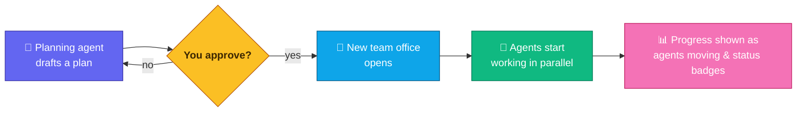
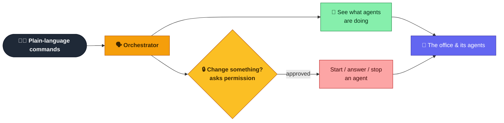
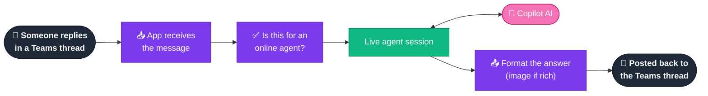
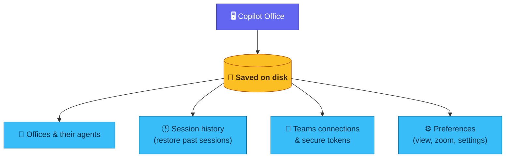

# Copilot Office — High-Level Overview

A simplified, concept-only companion to [`architecture.md`](./architecture.md) and
[`architecture-diagram.md`](./architecture-diagram.md). No file names — just the big ideas
and how they connect. Preview in VS Code with a Mermaid-capable Markdown preview.

---

## 1. The Big Picture

Copilot Office is a desktop app where you walk around a virtual office and talk to AI
agents. Under the hood, three processes cooperate: the **game & UI**, a **coordinator**,
and a **terminal engine** that runs real Copilot sessions.

```mermaid
flowchart LR
  User(["🧑‍💻 You"]):::actor --> Game

  subgraph Game["🎮 Game & UI"]
    direction TB
    World["Office world<br/>& agents you talk to"]:::a
    Terminals["Terminal & dashboard<br/>screens"]:::a
    Orchestrator["Orchestrator<br/>(talk to run the whole office)"]:::a
  end

  subgraph Coordinator["⚙️ Coordinator (traffic controller + services)"]
    direction TB
    Routing["Routes UI ⇄ engine<br/>& fans out results"]:::b
    OrchSvc["Runs the orchestrator agent"]:::b
    TeamsSvc["Connects to Teams"]:::b
    Services["Windows · settings · notifications<br/>· saving · process cleanup"]:::b
  end

  subgraph Engine["🧵 Terminal Engine"]
    direction TB
    Sessions["Live agent sessions<br/>(one per agent, per office)"]:::c
  end

  subgraph Outside["🌐 Outside World"]
    direction TB
    Copilot["Copilot AI runtime"]:::d
    Teams["Microsoft Teams"]:::d
    Storage[("Saved data on disk")]:::disk
  end

  Game <--> Coordinator
  Coordinator <--> Engine
  Engine <--> Copilot
  Coordinator <--> Teams
  Game <--> Storage
  Coordinator <--> Storage

  classDef actor fill:#1f2937,stroke:#111827,color:#f9fafb,font-weight:bold;
  classDef a fill:#6366f1,stroke:#3730a3,color:#fff;
  classDef b fill:#0ea5e9,stroke:#075985,color:#fff;
  classDef c fill:#10b981,stroke:#047857,color:#fff;
  classDef d fill:#f472b6,stroke:#be185d,color:#fff;
  classDef disk fill:#fbbf24,stroke:#b45309,color:#3b2600,font-weight:bold;
```

---

## 2. Talking to an Agent

When you open an agent's terminal, your request travels down to a real Copilot session and
the responses stream back up to the screen.

---

## 3. Meetings → A Team of Agents

You brief a planning agent, approve its plan, and a whole team of agents spins up in a new
office to work in parallel — visualized as NPCs moving around.

---

## 4. Running the Office by Conversation

Instead of walking to each agent, you can talk to one **orchestrator** in plain language.
It can look at what everyone's doing and act on your behalf — but anything that changes
state always asks your permission first.

---

## 5. Driving Agents from Teams

Any agent can be brought "online" in a Microsoft Teams channel thread. People reply in the
thread to drive the agent, and its answers post back — so you can use it without opening the
app.

---

## 6. What Gets Remembered

The app saves the things that should survive a restart, so your offices, sessions, and
connections come back the way you left them.

---

*Simplified overview — for the detailed, file-level architecture see `architecture.md` and
`architecture-diagram.md` in this folder.*
