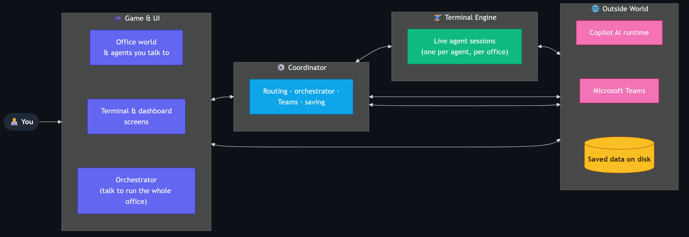
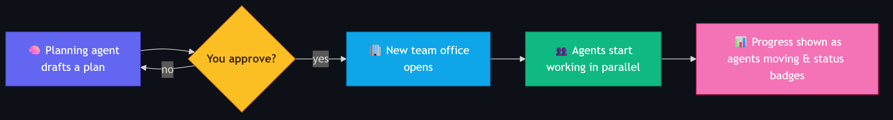
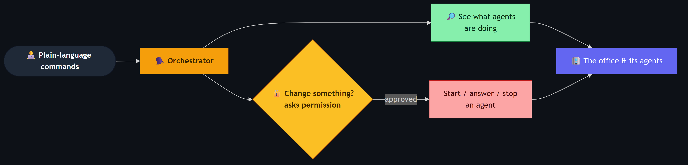
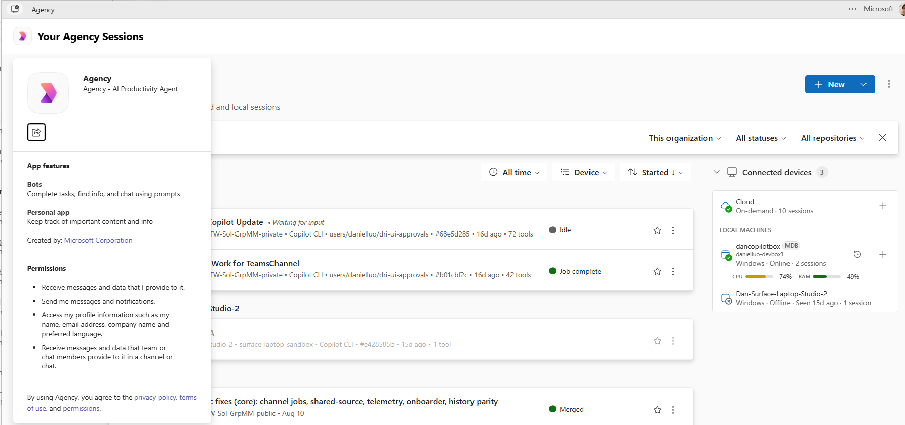

<!-- _class: lead -->

# 🏢 Copilot Office

### A virtual office that makes multi-agent AI development **visible and manageable**

AI Accessibility for Humans *(just a joke?)*

<!--
Speaker notes:
Copilot Office began as a personal experiment to make working with AI agents feel
less fragmented. It grew into a practical way to manage many concurrent Copilot
sessions with full visibility.
-->

---

<!-- _class: lead -->

# Motivation

### Multi-agent development is fragmented "today"

---

## The problem

Working across multiple AI agents today means:

- **Multiple terminals**, side by side
- **Constant context switching** between them
- **No shared view** of who is doing what

One powerful capability we're taking advantage of is **parallel agentic work**:
multiple agents can make progress simultaneously, but without visibility and
coordination, it is easy to lose track and context.

<!--
Speaker notes:
Multi-agent AI development today means multiple terminals and constant context
switching. At the same time, one powerful capability we're taking advantage of
is parallel agentic work: multiple agents can make progress at once, provided
you can see and coordinate them. The challenge is making that parallel work
manageable without losing context.
-->

---

## The initial approach

> Represent each AI session as a **virtual teammate at a desk** in a shared workspace.

**Copilot Office** — a virtual office for managing AI work.

- Navigate by **mouse** or keyboard
- Each desk is a **real GitHub Copilot CLI session**, live in a terminal
- Real agents performing real work — not scripted interactions

<!--
Speaker notes:
The idea: visualize each AI chat as a virtual teammate at a desk. Copilot Office is a
virtual office for AI productivity. You interact with mouse clicks or keyboard
movement, and each desk is a real Copilot CLI session.
-->

---

## The big picture



Three processes cooperate: the **game & UI**, a **coordinator**, and a **terminal engine** running real Copilot sessions.

<!--
Speaker notes:
At a high level, three processes cooperate. The game and UI is what you see and
interact with. A coordinator manages windows, settings, notifications, and the
Teams link. A terminal engine runs the live agent sessions that talk to the
Copilot AI runtime. Saved data on disk lets everything survive a restart.
-->

---

<!-- _class: lead -->

# Session management

### From experiment to daily workflow

---

## Persistent sessions

The core value is **visibility and continuity**:

- **Start new** conversations or **resume previous** sessions
- Sessions are **tracked and persisted** across restarts
- **Custom titles** indicate what each agent is working on
- **Real-time status**: *thinking*, *waiting*, or *done*

Full visibility at a glance — without cycling through terminal tabs.

<!--
Speaker notes:
Start new conversations or resume previous sessions. They're tracked and persisted
even after restart. Custom titles show what each agent is working on, and
real-time status badges show who's thinking, waiting, or done.
-->

---

## One office per project / directory

- **Multiple offices** — one per project or workstream
- **Independent** agent state and working directory per office
- Switch between them without losing context

<!--
Speaker notes:
Each office keeps its own agents and working directory. An office can be
soft-reloaded to pick up a feature you just built without restarting everything.
-->

---

## [Deprecated] Meeting Mode → a team of agents

- **Meeting Mode turns a complex request into an approved plan and parallel sub-agent work.**
- **The purpose was to try visualizing sub-agents as they work, with progress visible in one place.**



<!--
Speaker notes:
This started as an attempt to visualize sub-agents: a planning agent drafts a
plan, you approve it, a team office opens, and agents work in parallel with
visible progress.
-->

---

## Mini demo

<video src="assets/mini-meeting.mp4" controls autoplay muted loop width="1000"></video>

<!--
Speaker notes:
Mini demo of Meeting Mode in action: briefing the planning agent, approving the
plan, and the fleet of sub-agents spinning up to work in parallel.
Note: the video only plays in the HTML build — present from CopilotOffice.html.
-->

---

<!-- _class: lead -->

# Extensibility

### Custom integrations

---

## Teams as an access and organization layer

Teams becomes a familiar bridge between personal session management and
organizational collaboration:

- Organize sessions through familiar **channels and threads**
- Reopen and interact with sessions from **wherever you are**
- Make selected sessions accessible to the **wider team**
- Keep context and responses in a shared place

<!--
Speaker notes:
Teams becomes a familiar bridge between personal session management and
organizational collaboration. Sessions can be organized through channels and
threads, accessed from wherever you are, shared with the wider team, and kept
in one place with their context and responses.
-->

---

## 🎩 Office Orchestrator

A concierge agent you talk to in plain language:

> *"I need someone to review my code."*

- Proposes the right agent and, on **your approval**, brings them online
- Lists and **switches between offices** to find the right agent
- Always **gated** — asks before acting, even in YOLO mode
- Can itself be **brought online in Teams**

<!--
Speaker notes:
The orchestrator is a concierge that identifies the right agent for a described
task and brings it online after approval. It can also be driven from Teams.
-->

---

## Running the office by conversation



Read-only actions run freely; **anything that changes state asks permission first**.

<!--
Speaker notes:
You give plain-language commands to one orchestrator. It can look at what everyone
is doing freely, but anything that changes state — starting, answering, or
stopping an agent — always asks your permission first.
-->

---

<!-- _class: lead -->

# LIVE DEMO

---

## Challenges

1. **Inconsistent terminal experiences** — routing messages through Copilot was unreliable at first; the Copilot SDK resolved this with one clean entryway.
2. **Rendering content effectively** — without an Azure Service Bot, messages can
   look clunky in Teams, so I made skills around them to improve visibility and
   readability.
3. **Tagging myself in Teams** — currently handled through an external Power
   Automate flow because the game sends messages on my behalf and cannot
   naturally @mention me in Teams.
4. **Unlimited potential / options** — there are so many directions to go and
   enhancements to make.
5. **Why am I building this?** — an important question to ask myself.

---

## Catching up

AI tooling has already made good progress on several gaps that motivated this
project:

- **GitHub Copilot** is being updated frequently and now includes session
  persistence, interruption awareness, and many other improvements I cannot
  list exhaustively here
- **Scout** integrating as a tool in Microsoft Teams
- **Agency** hosting sessions from any of your managed devices



---

## As other products catch up, why build this?

Even when the ecosystem catches up, I would still build this because it offers:

- A **visual, spatial mental model** for concurrent AI work
- A focused **playground for testing ideas** about agents, orchestration, and
  presence
- Products move slowly, workflows shift quickly; iterating on ideas tuned to
  your workflows can create a major advantage

<!--
Speaker notes:
These are working hypotheses for now. The point is no longer to fill every gap
in the tooling ecosystem. It is to explore a different interface for AI work,
learn by building, and create a coherent environment where ideas about agents and
orchestration can be tested quickly.
-->

---

## Try it

```bash
# Install globally
npm i -g copilotoffice
copilotoffice
```

| Key | Action |
|-----|--------|
| `WASD` / Arrows | Move · `Shift` Sprint |
| `E` | Interact with agent / object |
| `Esc` / `F10` | Close terminal or mini-game |

Or switch to **serious mode** to get some real productivity out of it.

---

<!-- _class: lead -->

# Thank You

### 🏢 Copilot Office

Observable, manageable multi-agent development.

[npmjs.com/package/copilotoffice](https://www.npmjs.com/package/copilotoffice)
